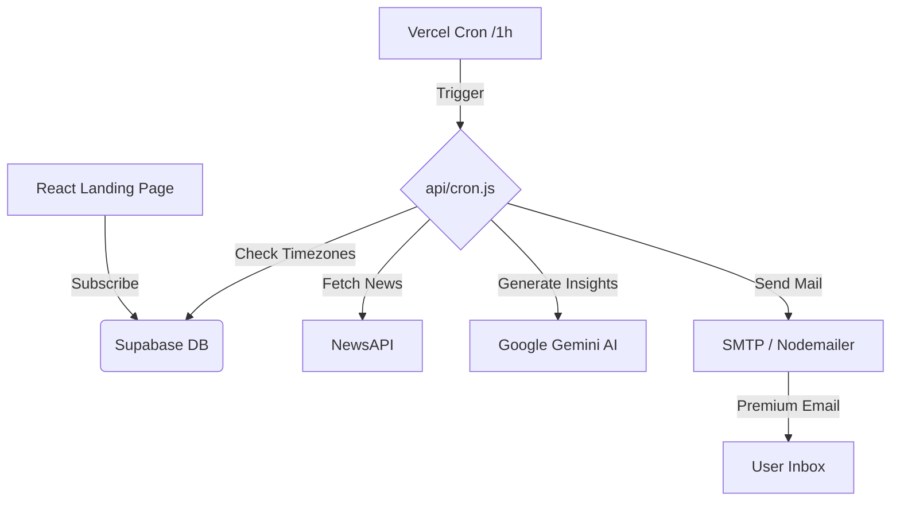

# AI Insights: Premium Newsletter System 🚀

[](https://react.dev/)
[](https://vercel.com/)
[](https://supabase.com/)
[](https://ai.google.dev/)
[](https://newsapi.org/)

## 🌟 Live Experience
[Explore the Newsletter](https://news-letter-umber-five.vercel.app/)

---

## 📖 The Vision
**AI Insights** is not just a mailing list; it's a high-end, fully automated intelligence engine. It fetches the most impactful breakthroughs in artificial intelligence from reputable sources, processes them using state-of-the-art LLMs, and delivers a premium, personalized briefing directly to your inbox at the perfect moment—9:00 AM in your specific timezone.

---

## ✨ Cutting-Edge Features

- 🧠 **AI-Powered Curation** – Leverages `gemini-2.5-flash-lite` to generate deep-dive technical insights.
- 📡 **Real-time Global News** – Powered by NewsAPI to fetch the most discussed breakthroughs from tech giants like OpenAI, Nvidia, and Anthropic.
- ⏰ **Dynamic Timezone Delivery** – Intelligent hourly scheduling ensures users receive their update at exactly 9:00 AM local time, anywhere in the world.
- 🎨 **Premium Aesthetic** – Stunning glass-morphism landing page and modern, card-based email design.
- 🛠️ **Serverless Architecture** – Fully automated via Vercel Cron Jobs and Supabase.
- 🔗 **One-Click Unsubscribe** – Smooth, frictionless user data management.

---

## 🏗️ Technical Architecture



---

## 🛠️ Tech Stack & Dependencies

| Layer | Technology | Role |
| :--- | :--- | :--- |
| **Frontend** | React + Vite | Stunning subscription UI |
| **Database** | Supabase | Secure user & timezone storage |
| **Logic** | Node.js (Vercel) | Automated cron & processing |
| **Intelligence** | Google Gemini | Content synthesis & insights |
| **Insights** | NewsAPI | Real-time global technical data |
| **Delivery** | Nodemailer | Premium template distribution |

---

## 🚀 Deployment & Configuration

### 1. Environment Variables
To power the system, configure these in your `.env` or Vercel Dashboard:

```env
# Supabase
VITE_SUPABASE_URL=...
SUPABASE_SERVICE_ROLE_KEY=...

# Intelligence
GEMINI_API_KEY=...
NEWS_API_KEY=...

# Email (SMTP)
SMTP_USER=...
SMTP_PASS=...
SMTP_FROM=AI Insights <your-email@gmail.com>
```

### 2. Vercel Cron Setup
The system is pre-configured with `vercel.json` to handle hourly tasks. Just deploy your repository to Vercel, and the automation will activate instantly.

---

## 📧 Premium Newsletter Sample

*A high-end briefing designed to keep you ahead of the curve.*

---

## 💬 Contact & Support
**Muhammad Usman**  
[GitHub](https://github.com/MuhammadUsmanGM) | [LinkedIn](https://www.linkedin.com/in/muhammad-usman-ai-dev)

Made with ❤️ and AI for the developers of the future.
