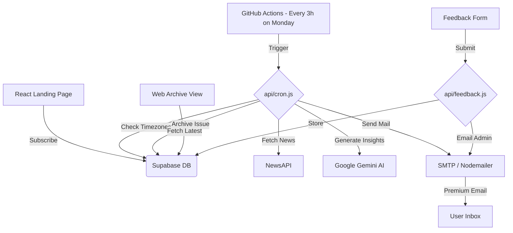
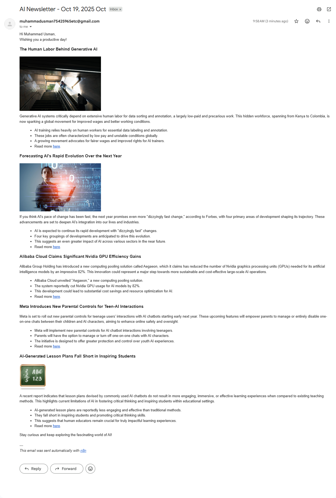

# THE SIGNAL: Premium Intelligence Protocol 📡

## 🌟 Live Experience

---

## 📖 The Vision
**THE SIGNAL** is not just a mailing list; it's a high-end, fully automated intelligence engine. It fetches the most impactful breakthroughs in artificial intelligence from reputable sources, processes them using state-of-the-art LLMs, and delivers a premium, personalized briefing directly to your inbox at the perfect moment—9:00 AM in your specific timezone.

---

## ✨ Cutting-Edge Features

- 🧠 **AI-Powered Curation** – Leverages `gemini-2.5-flash-lite` to generate deep-dive technical insights.
- 📡 **Real-time Global News** – Powered by NewsAPI to fetch the most discussed breakthroughs from tech giants like OpenAI, Nvidia, and Anthropic.
- ⏰ **Dynamic Timezone Delivery** – Intelligent scheduling ensures users receive their update at exactly 9:00 AM local time, anywhere in the world.
- 🌐 **Web Archive Protocol** – Users can access the latest intelligence briefing directly in the browser without email access.
- 🎨 **Premium Aesthetic** – Stunning glassmorphism landing page, feedback form, and modern, card-based email design.
- 🛠️ **Serverless Architecture** – Fully automated via GitHub Actions + Vercel Cron Jobs and Supabase.
- 📬 **Feedback Channel** – Premium feedback form for users to submit suggestions and bug reports.
- 🔗 **One-Click Unsubscribe** – Smooth, frictionless user data management.

---

## 🏗️ Technical Architecture

---

## 🛠️ Tech Stack & Dependencies

| Layer | Technology | Role |
| :--- | :--- | :--- |
| **Frontend** | React + Vite | Stunning subscription UI & feedback form |
| **Database** | Supabase | Secure user & timezone storage |
| **Logic** | Node.js (Vercel) | Automated cron & processing |
| **Intelligence** | Google Gemini | Content synthesis & insights |
| **Insights** | NewsAPI | Real-time global technical data |
| **Delivery** | Nodemailer | Premium template distribution |
| **Automation** | GitHub Actions | Weekly cron trigger (optimized) |

---

##  Premium Newsletter Sample

*A high-end briefing designed to keep you ahead of the curve.*

---

## 💬 Contact & Support
**Muhammad Usman**  
[GitHub](https://github.com/MuhammadUsmanGM) | [LinkedIn](https://www.linkedin.com/in/muhammad-usman-ai-dev)

Made with ❤️ and AI for the developers of the future.
