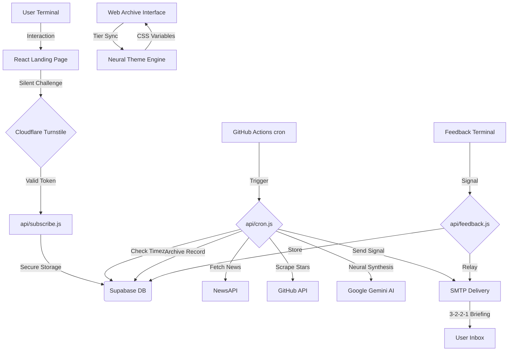

# THE SIGNAL: Premium Intelligence Protocol 📡

## 🌟 Live Experience

---

## 📖 The Vision
**THE SIGNAL** is not just a mailing list; it's a high-end, fully automated intelligence engine. It fetches the most impactful breakthroughs in artificial intelligence from reputable sources, processes them using state-of-the-art LLMs, and delivers a premium, personalized briefing directly to your inbox at the perfect moment—9:00 AM in your specific timezone. Following a strict **3-2-2-1** protocol, it ensures you never miss a signal.

---

## ✨ Cutting-Edge Features

- 🛡️ **Elite Security Layer** – Protected by **Cloudflare Turnstile** to ensure zero spam and bot-free comms.
- 🧠 **AI-Powered Curation** – Leverages `gemini-2.5-flash-lite` to synthesize a weekly **3-2-2-1** technical briefing.
- 🐙 **GitHub Signal Node** – Scans trending AI repositories to identify explosive growth in dev tools and libraries.
- 📡 **Real-time Global News** – Powered by NewsAPI to fetch the most discussed breakthroughs from tech giants like OpenAI, Nvidia, and Anthropic.
- ⏰ **Dynamic Timezone Delivery** – Intelligent scheduling ensures users receive their update at exactly 9:00 AM local time, anywhere in the world.
- 🌐 **Web Archive Protocol** – Users can access the latest intelligence briefing directly in the browser.
- 🏛️ **The Protocol Vault** – A full historical archive of all past signals and breakthroughs.
- 🎨 **Neural Theme Synchronization** – The entire UI evolves through a **10-tier weekly spectrum** (Green to Red) based on subscriber loyalty.
- 🌈 **Prism Protocol** – Long-term loyalists (Week 10+) unlock total UI customization power.
- 📱 **Mobile Protocol (PWA)** – Install THE SIGNAL as a standalone app on your mobile device for an elite, app-like experience.
- 📡 **Live Signal Ticker** – Real-time AI news feed scrolling at the bottom of the interface.
- 🎙️ **Neural Voice Relay** – Built-in browser-based text-to-speech engine to listen to briefings hands-free.
- 🖼️ **Dynamic Social Previews** – AI-generated Open Graph images for every issue to drive professional engagement on X and LinkedIn.
- 🎨 **Premium Aesthetic** – Stunning glassmorphism landing page, feedback form, and modern, card-based email design.
- 🛠️ **Serverless Architecture** – Fully automated via GitHub Actions + Vercel Cron Jobs and Supabase.
- 📬 **Feedback Channel** – Premium feedback form for users to submit suggestions and bug reports.
- 🎖️ **Neural Tiers** – Dynamic gamification that ranks users (Alpha Initiate → Node Commander → Signal Architect) based on protocol loyalty.
- 🔗 **One-Click Unsubscribe** – Smooth, frictionless user data management.

---

## 🏗️ Technical Architecture

---

## 🛠️ Tech Stack & Dependencies

| Layer | Technology | Role |
| :--- | :--- | :--- |
| **Frontend** | React + Vite | Stunning subscription UI & feedback form |
| **Security** | Cloudflare Turnstile | Advanced anti-spam & bot protection |
| **Database** | Supabase | Secure user & timezone storage |
| **Logic** | Node.js (Vercel) | Automated cron & processing |
| **Intelligence** | Google Gemini | Content synthesis & insights |
| **Insights** | NewsAPI | Real-time global technical data |
| **Delivery** | Nodemailer | Premium template distribution |
| **Automation** | GitHub Actions | Weekly cron trigger (optimized) |

---

## 💬 Contact & Support
**Muhammad Usman**  
[GitHub](https://github.com/MuhammadUsmanGM) | [LinkedIn](https://www.linkedin.com/in/muhammad-usman-ai-dev)

Made with ❤️ and AI for the developers of the future.
